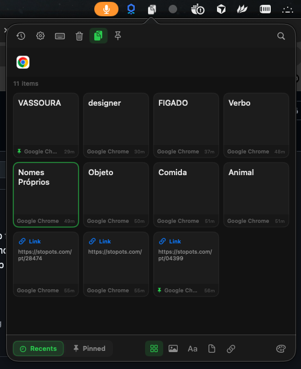

# ClipboardApp

> A lightweight macOS menu bar app to save, search, pin and categorize your clipboard history by app.

<p align="center">
  
</p>

---

## Features

- **Clipboard history** — automatically captures every text, URL, image and file you copy
- **Per-app tracking** — filter your history by the source application
- **Pin items** — keep important clips accessible at the top, they are never auto-deleted
- **Search** — quickly find any clip with the built-in search bar
- **Content filters** — filter by type: text, images, links or files
- **Copy on click** — click any card to instantly copy it back to your clipboard and close the panel
- **Individual delete** — hover over a card to reveal delete (🗑) and pin (📌) buttons
- **Global hotkey** — open the panel from anywhere with **⌘⇧V**
- **Launch at login** — optionally start ClipboardApp automatically when you log in
- **Persistent storage** — history is saved in a local SQLite database and survives restarts
- **Max items setting** — configurable limit (default: 500 items)
- **Pin panel** — keep the panel open while you work with the pin button

---

## Requirements

| | |
|---|---|
| **macOS** | 15.0 or later |
| **Architecture** | Apple Silicon & Intel |

---

## Installation

### Download (recommended)

1. Go to the [**Releases**](https://github.com/Hellyson-Ferreira/ClipboardApp/releases/latest) page
2. Download the latest `ClipboardApp-vX.X.X.dmg`
3. Open the DMG and drag **ClipboardApp** to **Applications**
4. On first launch, right-click the app → **Open** to bypass Gatekeeper (unsigned build)

> ℹ️ Releases are built automatically on every push to `main` via GitHub Actions.

### Build from source

```bash
git clone https://github.com/Hellyson-Ferreira/ClipboardApp.git
cd ClipboardApp
open ClipboardApp.xcodeproj
```

Select the `ClipboardApp` scheme and press **⌘R**.

---

## Usage

| Action | How |
|---|---|
| Open / close panel | Click the **📋** icon in the menu bar or press **⌘⇧V** |
| Copy a clip | Click any card |
| Pin a clip | Hover the card → click **📌** |
| Delete a clip | Hover the card → click **🗑** |
| Filter by app | Click an app icon in the top row |
| Filter by type | Use the bottom bar icons (image / text / file / link) |
| View pinned items | Click the **Pinned** tab at the bottom |
| Clear history | Click the **🗑** toolbar button (pinned items are kept) |
| Pin the panel open | Click the **📌** button in the toolbar |
| Settings | Click the **⚙️** button or right-click the menu bar icon → Settings |
| Quit | Right-click the menu bar icon → Quit ClipboardApp |

---

## Settings

Open settings with **⚙️** or right-click the menu bar icon → **Settings…**

| Setting | Default | Description |
|---|---|---|
| Launch at Login | Off | Start ClipboardApp automatically at login |
| Global Shortcut | ⌘⇧V | Open the panel from any app |
| Max saved items | 500 | Oldest unpinned clips are removed when the limit is reached |

---

## Privacy

ClipboardApp runs **entirely on-device**. No data is ever sent to any server.  
All history is stored locally in:

```
~/Library/Application Support/ClipboardApp/clipboard.db
```

---

## Tech stack

- **Swift / SwiftUI** — UI and app logic
- **AppKit** — `NSStatusItem`, `NSPopover`, `NSWindow`
- **SQLite3** — local persistent storage (no third-party ORM)
- **Carbon** — global hotkey registration (`RegisterEventHotKey`)
- **ServiceManagement** — launch at login (`SMAppService`)
- **GitHub Actions** — automated DMG build and release on every push to `main`

---

## License

MIT © [Hellyson Ferreira](https://github.com/Hellyson-Ferreira)
